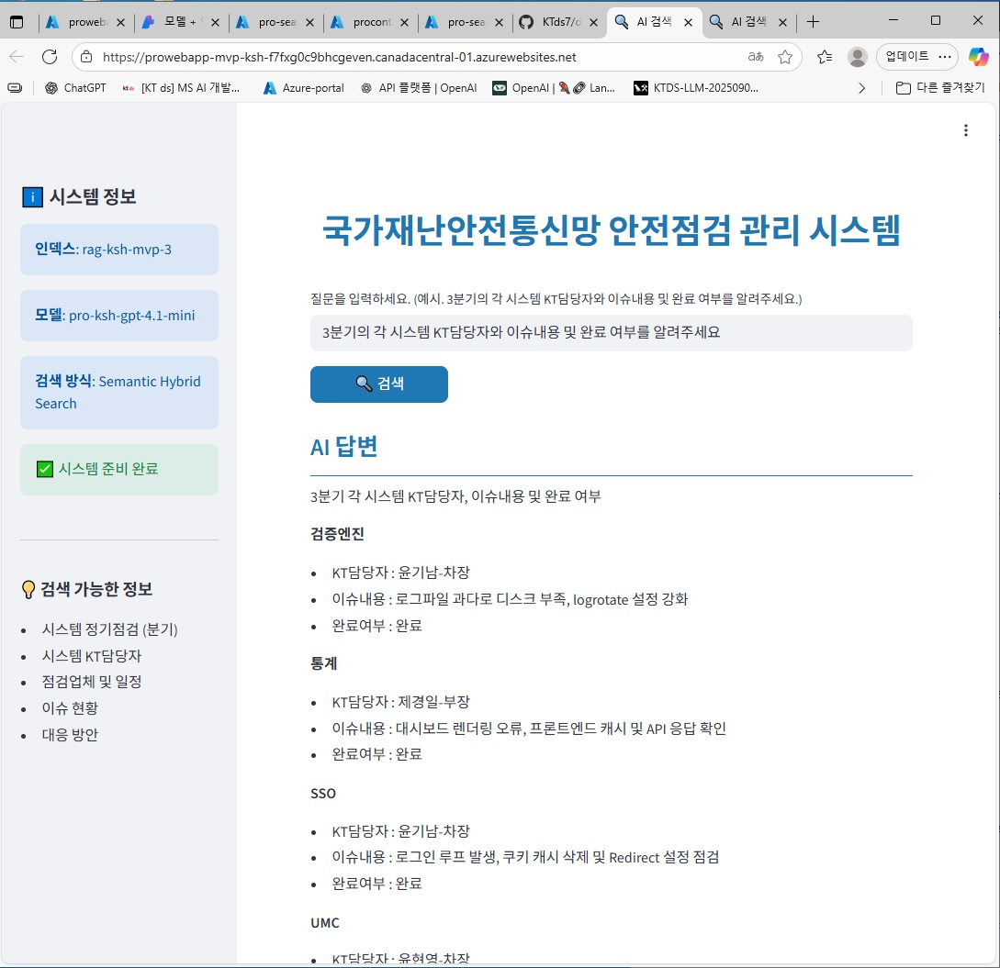

# 국가재난안전통신망 안전점검 관리 시스템
### MVP 제작 준비

 #### ◆ 요약 : Azure OpenAI + Azure AI Search를 직접 활용한 Streamlit 기반 RAG
 - 검색 데이터 타입 : 엑셀 (4개 파일 *.xlsx 업로드 인덱싱) 
 - Resource group : pro-resource-ksh-1027
 - Azure OpenAI : pro-openai-ksh-1027
 - Search service : pro-search-ksh-1027
 - Storage account : prostorageaccountmvpksh
 - Web App : prowebapp-mvp-ksh
 - 인덱스 : rag-ksh-mvp-3
 - 언어모델 : pro-ksh-gpt-4.1-mini
 - 임베딩 모델 : pro-ksh-text-embedding-3-large
 - 검색 방식 : Semantic Hybrid Search
 - 엑셀 구분값 : 시트(분기), 시스템, KT담당자, 업체명, 업체당당자, 점검일, 이슈내용, 이슈처리사항
 - 시스템 항목 : "검색엔진", "통계", "SSO", "UMC", "PORTAL", "VMWare", "DB", "내부연계", "ITSM", "IAM", "HPE SERVER", "앱스토어", "외부연계", "BSS", "CHATBOT", "OFCS"
   

### 구축 목적
 ㅇ 국가재난안전통신망의 정기점검 시 발생한 이슈와 결과를 데이터베이스 저장파일(엑셀)을 통하여 확인. 
 ㅇ GPT엔진을 이용하여 대응방안을 제시받을 수 있고 차기 분기 점검일정도 추천받을 수 있는 시스템 구축. 
 ㅇ 분기 점검 진행시 업체별 점검일정 사전 조율.
   

### 제작 배경
 ㅇ 분기별 점검이 매년 진행이 되고 있으나 점검 내역관리가 되어 있지 않아 정보의 유실이 발생. 
 ㅇ kt측의 분기별 점검 정보 요청 및 이슈 대응관리 및 향후 유사 이슈 발생에 대한 과거 대응 정보 필요성.
   

### 분기 점검 결과 및 이슈 관리
 ㅇ 점검이 진행된 분기별 발생한 이슈를 검색하고 대응방안을 GPT를 이용하여 검색 가능하도록 함. 
 ㅇ 점검 완료 및 미처리, 결과 확인 관리. 
 ㅇ 시스템 오류, 이슈 발생으로 미처리된 건에 대한 조치 계획 수립. 
 ㅇ kt측의 분기별 점검 정보 요청 및 이슈 대응관리 및 향후 유사 이슈 발생에 대한 과거 대응 정보 필요성.
   

### 점검일/시간 생성 (자동생성)
 ㅇ 차기 분기 시스템별 점검 일정을 추천받아 업체 점검일정생성에 있어 효율성 기대. 
 ㅇ 향후 조건 (kt담당자 근무시간)을 추가하여 점검시간의 적확도를 높일 수 있도록 함.
   
 
## 🔹 모델 구성
### 1. 환경 설정 및 라이브러리 로드
 ㅇ os, dotenv : 환경변수(.env)에서 API 키, 엔드포인트 불러오기 
 ㅇ AzureOpenAI : GPT 모델 호출을 위한 SDK 
 ㅇ Streamlit : 웹 UI 구현 
 ㅇ pandas : 표 형태 데이터 처리 및 정렬 
 ㅇ random, re, datetime: 일정 추천, 정규표현식, 날짜 계산 등
  

### 2. Streamlit UI 구성
 ㅇ 페이지 설정 : st.set_page_config 
 ㅇ 사이드바 : 시스템 정보, 인덱스, 모델, 검색 방식, 상태 표시 
 ㅇ 메인 UI : 제목, 질문 입력창, 검색 버튼
  

### 3. 점검 일정 추천 기능 (점검 예정 분기)
 ㅇ system_list : 점검 대상 시스템 목록 
 ㅇ available_times : 점검 시간 후보 
 ㅇ holidays_2025, quarter_periods : 점검 불가 날짜 정의 
 ㅇ 함수 
   - get_available_dates(quarter) : 분기 내 공휴일/주말 제외한 날짜 리스트 생성 
   - create_inspection_schedule(systems, times, quarter) : 하루 2개 시스템 점검, 시간 중복 방지, 랜덤 배정
  

### 4. GPT + RAG '엑셀 점검 자료' 검색 기능
 ㅇ 프롬프트 정의 : 시스템 역할, 답변 형식, 사용자 질문 
 - rag_params : 
 - data_sources : Azure AI Search 설정 
 - query_type : vector + semantic hybrid 
 - embedding_dependency : 임베딩 모델 (text-embedding-3-large) 
 - 관련성 필터(strictness), 검색 범위(in_scope) 등  

 ㅇ GPT 호출 (Azure OpenAI API) 
&nbsp;&nbsp;&nbsp;&nbsp;&nbsp;response = chat_client.chat.completions.create( 
&nbsp;&nbsp;&nbsp;&nbsp;&nbsp;model=DEPLOYMENT_NAME, 
&nbsp;&nbsp;&nbsp;&nbsp;&nbsp;messages=prompt, 
&nbsp;&nbsp;&nbsp;&nbsp;&nbsp;extra_body=rag_params, 
&nbsp;&nbsp;&nbsp;&nbsp;&nbsp;temperature=0.0, 
&nbsp;&nbsp;&nbsp;&nbsp;&nbsp;max_tokens=5000 
&nbsp;&nbsp;&nbsp;&nbsp;&nbsp;)
  

### 5. 전체 구조 흐름
 ㅇ 환경변수 로드 → Azure OpenAI 체크 → 정상여부 표시 Streamlit UI 표시 
 ㅇ 사용자가 질문 입력 → 검색 버튼 클릭 
 ㅇ 점검일정 요청 관련 → create_inspection_schedule 실행 → 표 형태 출력 
 ㅇ 점검내역 검색 관련 → GPT + RAG 호출 → 답변 출력 
  

  

### MVP
[URL] : [MVP-KSH-LINK](https://prowebapp-mvp-ksh-f7fxg0c9bhcgeven.canadacentral-01.azurewebsites.net/)

 

[질문 예시]
1. 3분기의 각 시스템  KT담당자와 이슈내용 및 완료 여부를 알려줘.
2. 3분기의 각 시스템 점검내역을 알려줘.
3. 3분기의  검색엔진  업체명을 알려줘.
4. 3분기의  검색엔진  KT담당자를 알려줘.
5. 3분기의 검색엔진의 KT담당자와 점검내역을 알려줘.
6. 3분기의 각 시스템  KT담당자와 업체명 이슈내용 및 완료 여부를 알려줘.
7. 3분기의 시스템 이슈에 대한 대응방안을 추천해줘.
8. 4분기 점검일정을 추천해줘.
